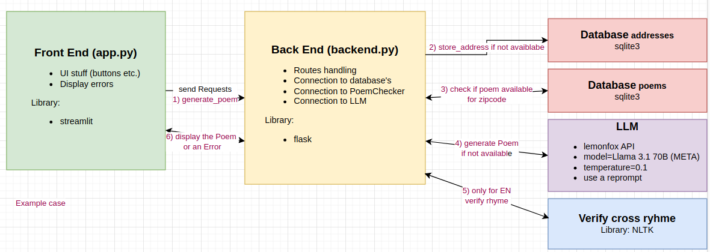

# cityRhym
[cityRhym](https://github.com/CesMak/cityRhym) is a cross rhym generater for your city!
It generates a funny poem about the local eating and drinking habits in your city!

# Task definition
Create a state-of-the-art web service based on standard libraries. It is an address service with built-in lyric functionality. Addresses can be created and
queried. Based on the address, a funny poem about their place of residence and local eating and drinking habits is automatically generated. If a poem has already been created for the place of residence by another, this will be delivered, otherwise a new one will be created. For each location
only one poem exists. The addresses entered in this way (incl. poem) can be created, queried, changed and deleted. The poem should be in cross rhyme (ABAB).

# Architecture


# Prompting
* see backend.py:
```
PROMPT_EN     = "Create a funny poem with a cross rhyme about the eating and drinking habits in"
REPORMPT_EN   = "This was a couplet rhyme. Please rearrange the words such that the middle words rhyme! Only return the poem!"

PROMPT_DE     = "Erstelle ein lustiges Gedicht im Kreuzreim über die Essens und Triinkgewohnheiten in"
REPROMPT_DE   = "Das war ein Paarreim (AABB). Bitte gestalte den Reim zu einem Kreuzreim (ABAB) um. Gib nur den Reim  selbst zurück!"
```

# Try it out!
* Check and insert your LLM API credentials as environment_variable
* setup a virtual python environment
* install requirements.txt
* you may use these bash aliases:
```bash
export OPENAI_API_KEY="" 
alias cd_cr='source /home/markus/Desktop/cityRhyme/.env/bin/activate'
alias start_app='source /home/markus/Desktop/cityRhyme/.env/bin/activate && cd /home/markus/Desktop/cityRhyme/ && streamlit run ./app.py'
alias start_server='source /home/markus/Desktop/cityRhyme/.env/bin/activate && cd /home/markus/Desktop/cityRhyme/ && python3 backend.py'

```
* in one terminal execute start_app
* in another one execute start_server
* see the walkthrough for more instructions

# App Walkthrough
* click delete whole database
* click Deutsch
* enter your address - better choose a big city!
* click generate poem
* select a new address for e.g. würzburg 97070
* select a new name also living in würzburg
* test delete and show poems / addresses

# Additionall stuff

## Further TODO's
* do a live testing
* generate at least API Docu
* extend for more rhyms
* improve UI for editing and deleting addresses e.g. using states to store information
* May consider using another framework than streamlit

## Examples Gemini - de
* Berlin
    ```
    In Berlin, da gibt's 'nen Dönerladen weit und breit,
    Mit Fleisch und Soße, das schmeckt einfachheit.
    Ein Currywurststand, der ist auch nicht weit,
    Mit Pommes, Mayo, das ist mein Lieblingsspeisekleid.

    Ein Berliner Weiße, das ist doch was Feines,
    Mit Schuss oder ohne, das erfrischt die Keime.
    Ein Bierchen dazu, das passt doch ganz prächtig,
    So schmeckt das Leben in der Hauptstadt so richtig.
    ```
* München
    ``` 
    In München, da gibt’s die Wiesn, das ist bekannt,
    Ein Weißwurstfrühstück, das ist ein Gedicht.
    Mit Maßkrugstemmen, das ist ganz gespannt,
    Mit Brezn und süßem Senf, das schmeckt so richtig.

    Im Hofbräuhaus sitzt man gemütlich und froh,
    Ein Leberkäse, der ist auch nicht schlecht.
    Mit einem Maß Bier, das geht immer so,
    Mit Kartoffelsalat, das ist ein Fest.
    ``` 
## Examples Mistral
* https://anakin.ai/apps/chat-with-mistral-7-b-instruct-online-chatbot-18038
In the heart of Europe, where the Spree doth flow, Lies Berlin, where the bratwurst aglow,
With a quirky charm, and a curious vibe,
Where the locals feast, and the tourists jive.

In the market square, with a schnitzel in hand,
They clink their steins, in a joyous, hearty band,
Currywurst in the other, a tasty delight,
A Berliner's feast, a truly magical night.

But beware, the beer is as strong as a bear,
A single mug might leave you with a square,
So sip with care, and don't lose your bearings,
Or you'll find yourself in a Berlin slumber, earnest.

And when the night grows long, and the moon takes flight,
The city's nightlife, a sight to ignite,
From techno beats, to cabaret's delight,
Berlin's parties, a truly magical night.

So come one, come all, to this vibrant city,
Where the food, the drink, and the spirit's free,
In Berlin, where the laughter never dies,
A place where the fun, and the memories rise.
    Can you create a funny poem in cross rhyme about the city of Berlin and the local eating and drinking habits?

## Timeline
* Sa 16 Nov 8:30 - 10:30 for architecture and db stuff
* So 1h use LLM for generating the poems
* Mo fix some db bugs


