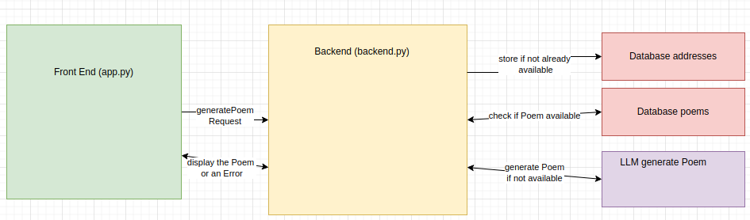

# cityRhym
[cityRhym](https://github.com/CesMak/cityRhym) is a cross rhym generater for your city!

# Task definition
Create a state-of-the-art web service based on standard libraries. It is
is an address service with built-in lyric functionality. Addresses can be created and
query. Based on the address, a funny poem about their place of residence and local eating and drinking habits is automatically generated.
local eating and drinking habits. If a poem has already been created for the place of residence by another
already created by another entry, this will be delivered, otherwise a new one will be created. For each location
only one poem exists per location.
The addresses entered in this way (incl. poem) can be created, queried, changed and deleted.

# Architecture
* 
* using Flask or Django or Angular would be a good chocice however its way to big
* thus I use the more familiar streamlit
* I also use as usual a python3 virtual environment
* requirements.txt is attached

# Prompting - de
* Kannst du mir ein lustiges Gedicht im Kreuzreim über die Stadt Berlin und die lokalen Essens- und Trinkgewohnheiten erzeugen?

# Examples - de
* Berlin
    ```
    In Berlin, da gibt's 'nen Dönerladen weit und breit,
    Mit Fleisch und Soße, das schmeckt einfachheit.
    Ein Currywurststand, der ist auch nicht weit,
    Mit Pommes, Mayo, das ist mein Lieblingsspeisekleid.

    Ein Berliner Weiße, das ist doch was Feines,
    Mit Schuss oder ohne, das erfrischt die Keime.
    Ein Bierchen dazu, das passt doch ganz prächtig,
    So schmeckt das Leben in der Hauptstadt so richtig.
    ```
* München
    ``` 
    In München, da gibt’s die Wiesn, das ist bekannt,
    Ein Weißwurstfrühstück, das ist ein Gedicht.
    Mit Maßkrugstemmen, das ist ganz gespannt,
    Mit Brezn und süßem Senf, das schmeckt so richtig.

    Im Hofbräuhaus sitzt man gemütlich und froh,
    Ein Leberkäse, der ist auch nicht schlecht.
    Mit einem Maß Bier, das geht immer so,
    Mit Kartoffelsalat, das ist ein Fest.
    ``` 
* 
# Timeline
* Sa 16 Nov 8:30 - 


